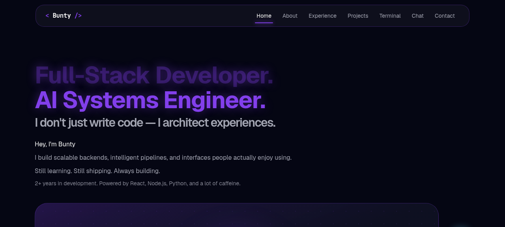
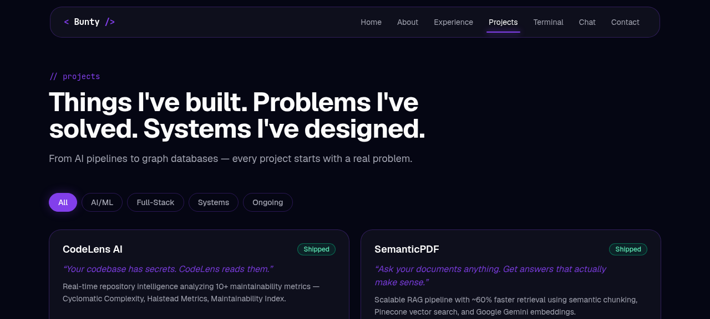
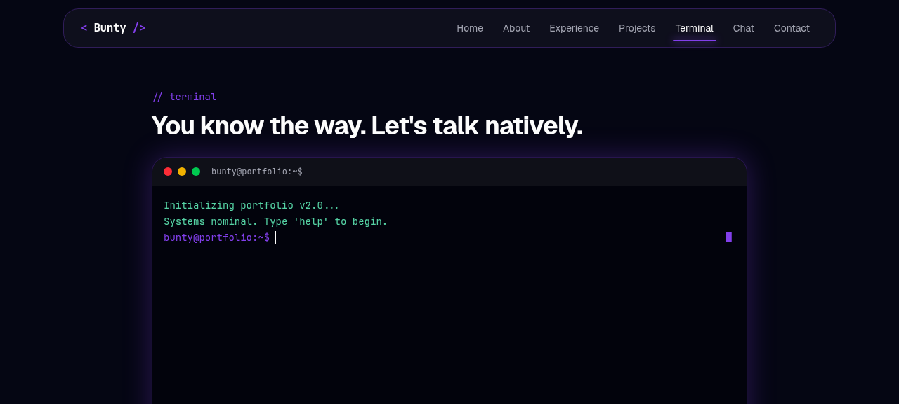
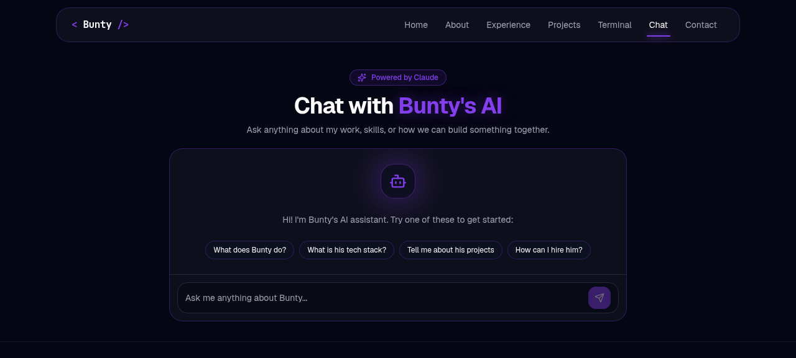

# < Bunty /> — Personal Portfolio

> Full-Stack Developer & AI Systems Engineer · Built with React, Next.js, TypeScript, Three.js & Framer Motion

[](https://my-portfolio-reloo.vercel.app/)
[](https://github.com/Bunty5600/my-portfolio)
[](https://nextjs.org/)
[](https://www.typescriptlang.org/)

---



---

## Overview

A cinematic, dark-themed personal portfolio showcasing my projects, experience, and skills as a Full-Stack Developer and AI Systems Engineer. Features scroll-driven animations, floating 3D tech badges, an interactive terminal, and an AI chat powered by Claude.

---

## Pages

| Page | Description |
|---|---|
| **Home** | Hero section with floating tech badges, 3D tilt avatar, and cinematic layout |
| **About** | Bio, skills grid, and background |
| **Experience** | Timeline of internships and education |
| **Projects** | Filterable project cards with GitHub and live links |
| **Terminal** | Fake interactive terminal — type `help` to begin |
| **Chat** | AI chat powered by Claude API, trained on my resume |
| **Contact** | Contact form + social links |

---

## Screenshots

| Projects | Terminal | Chat |
|---|---|---|
|  |  |  |

---

## Tech Stack

| Category | Technologies |
|---|---|
| **Framework** | Next.js 15 (App Router) |
| **Language** | TypeScript |
| **Styling** | Tailwind CSS |
| **Animation** | Framer Motion |
| **3D / WebGL** | Three.js, @react-three/fiber, @react-three/drei |
| **AI** | Anthropic Claude API (claude-sonnet-4-6) |
| **Deployment** | Vercel |
| **Package Manager** | pnpm |

---

## Features

- **Floating Tech Badges** — Colorful, animated badges representing my actual tech stack, floating around the hero section using Framer Motion
- **3D Tilt Avatar** — Mouse-tracking parallax tilt effect on the hero image using `useMotionValue` + `useSpring`
- **Interactive Terminal** — Fully functional fake terminal with commands: `whoami`, `projects`, `skills`, `experience`, `contact`, `github`, `clear`, and more
- **AI Chat** — Claude-powered chatbot with my resume as context — ask it anything about me
- **Project Filter** — Filter projects by category: All / AI/ML / Full-Stack / Systems / Ongoing
- **Dark / Light Mode** — Theme toggle with `localStorage` persistence
- **Glassmorphism UI** — Consistent dark glass card system with purple glow accents
- **Fully Responsive** — Mobile-first design, responsive across all breakpoints

---

## Projects Featured

| Project | Status | Stack |
|---|---|---|
| **CodeLens AI** | ✅ Shipped | Python, FastAPI, React, TypeScript |
| **SemanticPDF** | ✅ Shipped | React, Node.js, Pinecone, Google Gemini |
| **NotePilot** | 🔄 Ongoing | React, Socket.IO, Whisper, Python |
| **YouTube Gaming Analyzer** | 🔄 Ongoing | MongoDB, Neo4j, Redis, Three.js, XGBoost |
| **DSA With Development** | 📚 Active | Python, Markdown, GitHub |

---

## Getting Started

### Prerequisites

- Node.js 18+
- pnpm

```bash
npm install -g pnpm
```

### Installation

```bash
# Clone the repo
git clone https://github.com/Bunty5600/my-portfolio.git
cd my-portfolio

# Install dependencies
pnpm install

# Start dev server
pnpm dev
```

Open [http://localhost:3000](http://localhost:3000) in your browser.

### Environment Variables

Create a `.env.local` file in the root:

```env
ANTHROPIC_API_KEY=your_anthropic_api_key_here
```

> The AI Chat page requires a valid Anthropic API key. Get one at [console.anthropic.com](https://console.anthropic.com).

---

## Project Structure

```
my-portfolio/
├── app/                  # Next.js App Router pages
│   ├── page.tsx          # Home
│   ├── about/
│   ├── experience/
│   ├── projects/
│   ├── terminal/
│   ├── chat/
│   └── contact/
├── components/           # Reusable components
│   ├── floating-icons.tsx  # Animated tech badge system
│   ├── hero.tsx            # Hero section
│   ├── navbar.tsx          # Navigation
│   └── ui-bits.tsx         # Shared UI primitives
├── lib/
│   └── projects.ts       # Project data & types
└── public/
    └── icons/            # Tech stack icons
```

---

## Deployment

Deployed on **Vercel** with automatic deployments on push to `main`.

[](https://vercel.com/new/clone?repository-url=https://github.com/Bunty5600/my-portfolio)

---

## Connect

- **Email:** buntybhainsa0@gmail.com
- **LinkedIn:** [linkedin.com/in/bunty-bhainsa-75b6932a4](https://linkedin.com/in/bunty-bhainsa-75b6932a4)
- **GitHub:** [github.com/Bunty5600](https://github.com/Bunty5600)

---

<p align="center">Built by <strong>Bunty Bhainsa</strong> with React + TypeScript + Three.js</p>
<p align="center">
  <a href="https://my-portfolio-reloo.vercel.app/">🌐 Live Site</a> ·
  <a href="https://github.com/Bunty5600">👨‍💻 GitHub</a> ·
  <a href="mailto:buntybhainsa0@gmail.com">📧 Email</a>
</p>
